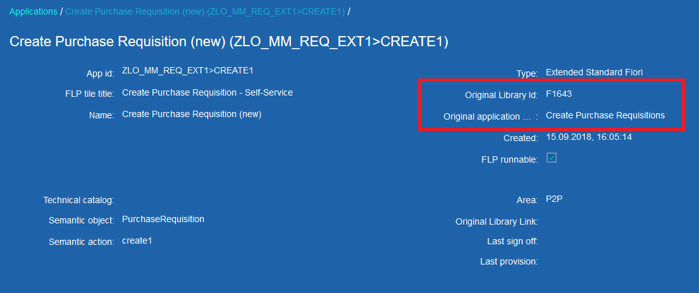
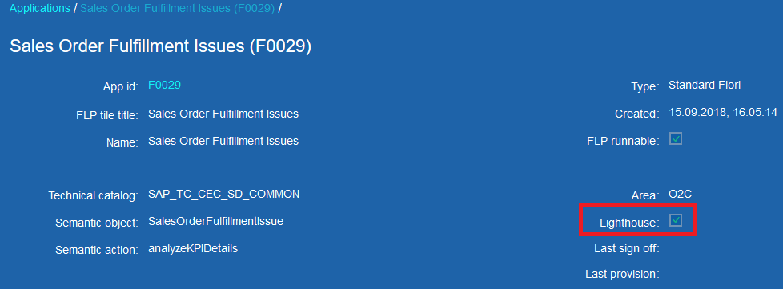

# Main config table 

## CatalogNamingRule 

**Rules for catalog naming**

You can specify your rules for catalog naming – f.e. a mandatory prefix that will help you quickly find your custom catalogs.

Default value: (^ZC_)

## CatalogsImportIsTechnicalCatalogCheckZC

**Activation of catalog naming convention check**

True - sets on the naming convention check
False – set it off
The application checks the rules set in the parameter "CatalogNamingRule." Verification takes place at:
- The entry in the catalog header edit mode
- The import from CVS file function in “Catalog app” in Administration mode (button “Catalogs CVS”)

## IsProductive 
**Sets installation of Fiori Tracker as a productive one**

True- Sets Fiori Tracker installation as productive
False – Sets it as Development and test
When you set it to **false** Fiori Tracker will display information that is meant to help users to comprehend that they are not looking at productive version of Fiori content documentation. The information will use the contents of parameters **ProductiveSystemAddress** and **ProductiveSystemId** to point out the system with productive data.

## ProductiveSystemAddress
**Sets the address of your productive system**

Used in:
-	Information message to point out the productive system address when you have set the parameter **IsProductive** to false.

## ProductiveSystemId
**Sets the production System ID**

Used in:
-	Information message to point out the productive system ID when you have set the parameter **IsProductive** to false.

## SapVersion
**Sets your S/4 HANA version**

Used in:
-	Generating link to Fiori library entry for an application. 
Fiori Tracker places a link for each Application Id for a standard Fiori application that has Fiori Library entry. The link is version-specific.

## IsSolManVersion
**Sets Fiori Tracker installation as installed on Solution Manager**

True – you have installed Fiori Tracker on Solution Manger
False – you installed it outside 

When set to **True** then Fiori Tracker will use a dedicated set of oData collections that authors prepared as a workaround for lack of the case insensitive queries in SAP Gateway 7.40 witch is the most popular version of SAP Solution Manager. When set to **False** Fiori Tracker will use the set of oData collection that use the standard function.

## Important notes
### Special behaviors for different app types

When you modify app types, you can also change values for these entries with the following fields (once you check it with 'X'):

`HAS LIBRARY LINK` - it enables you to proceed directly to app entry in Fiori Apps Reference Library when you click on its ID. It's used f.e. with Standard Fiori and SAP GUI apps

`HAS ORIGINAL LIBRARY ID` - it activates two more fields in application entry (Original Library ID and Original application). It's used f.e. with application extension

`CAN BE LIGHTHOUSE APP` - it activates 'Lighthouse' checkbox; using it you can easily mark applications from Lighthouse Scenario; it's used f.e. with Standard Fiori apps.

