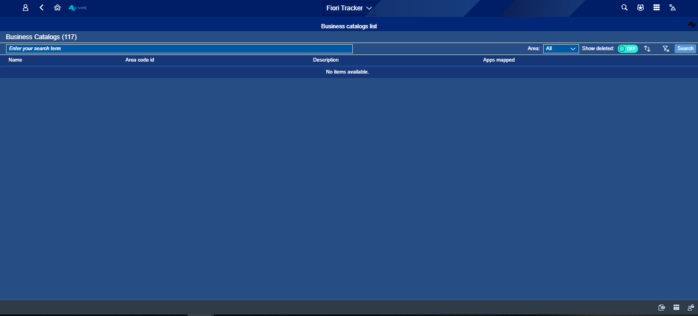
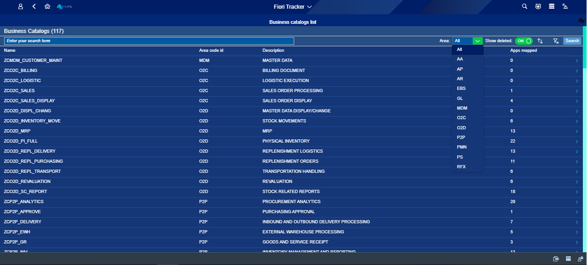

# Business Catalogs Overview

Main features of this application are:
- Drill down from catalogs, roles and applications
- Filter options for functional area
- Get status of the catalogs when it comes to testing and provisioning
- Find catalogs that do not comply with "to-be"state
- Export the list of the catalogs to Excel spreadsheet

After choosing Business Catalogs from the main menu, you can see an empty page – that will change in just one moment, but! At the bottom right of that page, you can see three icons that were not there before. 
By clicking on the first one, you can Export to CSV Your Catalogs list. The second one can take You to Applications tab – just like that! Moreover, the last one will transport You to Roles tab. 

*fig.1. Start view*

Now, look at the Business Catalogs List view - You can tap the name, or press Enter/ Search to list all catalogs. Next to Business Catalogs List, You can see counter – this is how much catalogs Your Fiori Tracker contains. 

When you start typing Your catalogs Name – Fiori Tracker is going to help you find the one you need!

*fig.2. While tapping catalogs name*

All catalogs listed after pressing Enter/ Search. You can see – counter works! It shows the number of existing catalogs.  The table shows what Name, Area code id is, what is the Description and how many Apps were mapped. 

*fig.3. After pressing Enter/Search button - name tapping skipped*

Filtering – You can filter Your catalogs by Area or, you can switch Show deleted button to ON mode (the default setting is the OFF mode).

*fig.4. Filtering options - Area; switch mode - ON*

If you want to see how many catalogs were deleted - switch ON/OFF mode in Show deleted option and check the counter.