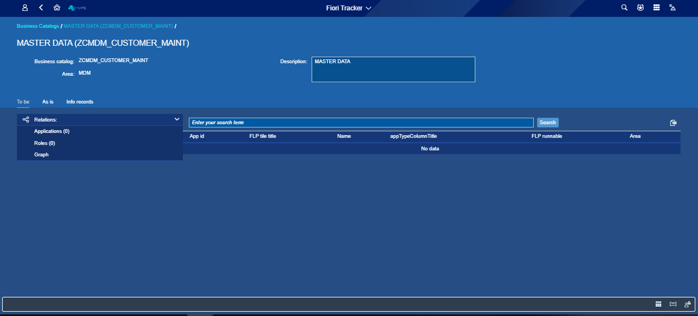
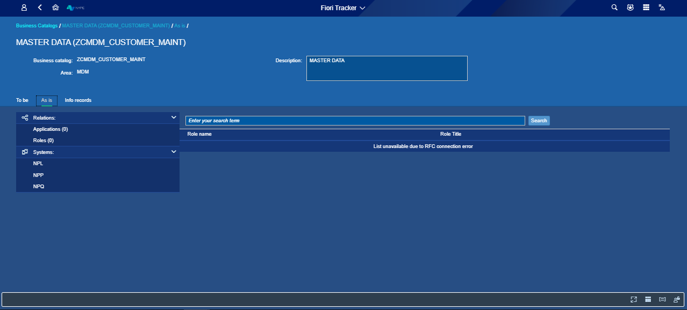
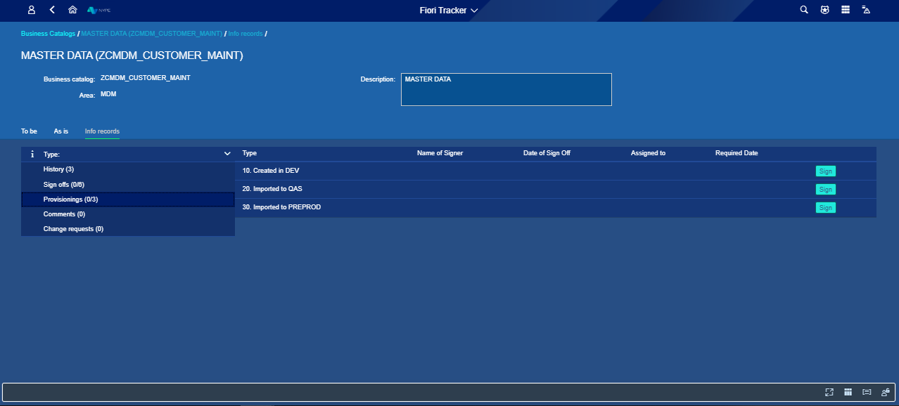

# Business Catalogs Overview

After choosing Business Catalogs from the main menu, you can see an empty page – that will change in just one moment, but! At the bottom right of that page, you can see three icons that were not there before. 
By clicking on the first one, you can Export to CSV Your Catalogs list. The second one can take You to Applications tab – just like that! Moreover, the last one will transport You to Roles tab. 

*fig.1. Start view*

Now, look at the Business Catalogs List view - You can tap the name, or press Enter/ Search to list all catalogs. Next to Business Catalogs List, You can see counter – this is how much catalogs Your Fiori Tracker contains. 

When you start typing Your catalogs Name – Fiori Tracker is going to help you find the one you need!

*fig.2. While tapping catalogs name*

All catalogs listed after pressing Enter/ Search. You can see – counter works! It shows the number of existing catalogs.  The table shows what Name, Area code id is, what is the Description and how many Apps were mapped. 

*fig.3. After pressing Enter/Search button - name tapping skipped*

Filtering – You can filter Your catalogs by Area or, you can switch Show deleted button to ON mode (the default setting is the OFF mode).

*fig.4. Filtering options - Area; switch mode - ON*

If you want to see how many catalogs were deleted - switch ON/OFF mode in Show deleted option and check the counter. 

**After choosing one catalog that you want to work with**

All the technical information that you need to work with a catalog is right here! Starting from its name through Area and Description to Relations that catalog has with Applications or with Roles, You can even see the whole Relations Graph – from the app itself to end-users! 
To be tab is the ideal situation – we want Your system to look like this at the end of Fiori Tracker implementation.  

You chose the listed catalog; here is what you will see:

*fig.5. Detailed catalog view - after choosing from the list and detailed Applications view*

As is tab shows how Your system looks in that very moment and how far the implementation is. For an app that we chose:

*fig.6. First look at the As is tab*

In the last tab – Info records, is complete changes history and documentation about progress with catalogs implementation.

*fig.7. Info records about chosen catalog - History*

In Sign offs You can see what kind of sign offs are available and – you can Sign off app by Yourself when You need it or Yu can see who has already made it. 

*fig.8. Info records about chosen catalog - Sign offs*

You can, as in Sign offs tab, see list of available Provisionings in Provisionings tab, and You can do it by yourself or see who has made it before you.  

*fig.9. Info records about chosen catalog - Provisionings*

In the next tab, you can add a comment in Comments, change some request that you have already made in Change requests tab and see who Test users are in the last tab. 

*fig.10. Info records about chosen catalog - Comments*

*fig.11. Info records about chosen catalog - Change request*
