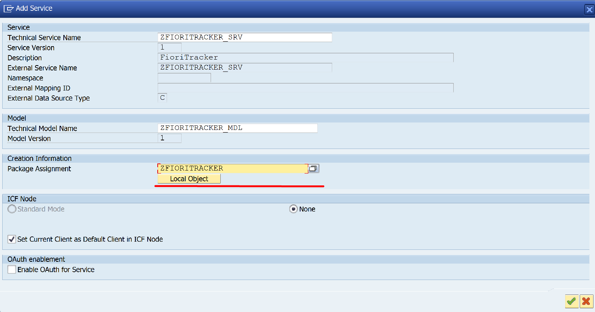
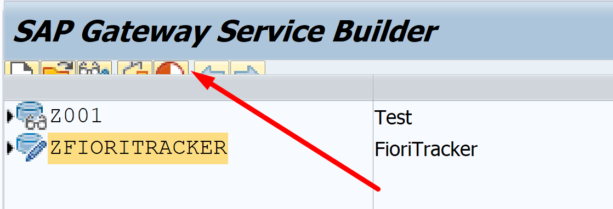

# Steps by Basis Expert

The following steps should be executed by a Basis Expert responsible for the system tha Fiori Tracker is installed to.

## Step 1 - Import the transports

Please import the transport requests that the Fiori Tracker team provides as:
- "Central system -> Main part"
- "Central system -> Roles for Main part"

## Step 2 - Activate services

Run `SICF` transaction and activate those ICF nodes: 
Path: `/default_host/sap/bc/ui5_ui5/sap/`
- zfioritracker
- zfioriodatamng 

Path: `/default_host/sap/opu/odata/sap/`
- ZFIORITRACKER_SRV

## Step 3 - Assign the roles

In `PFCG` transaction, assign the authorization roles to the users that you want to use for starting Fiori Tracker apps:
- ZFT_ALL
- ZFT_BASIS
- ZFT_FIORIDEV
- ZFT_FUNCTIONAL_APP_EXPERT
- ZFT_PMO
- ZFT_TESTER
- ZFT_SUPPORT_EXPERT

## Step 4 - Register the ZFIORITRACKER_SRV service

4.1 Proceed to *SEGW* transaction.
4.2 Open project *ZFIORITRACKER*

4.3 Expand *Service Maintenance* folder and double click on *GW_HUB*
4.4 Click on *Register* button.

4.5 Provide package name *ZFIORITRACKER*

4.6 Go to change mode and Generate Runtime objects for *ZFIORITRACKER_SRV* service

