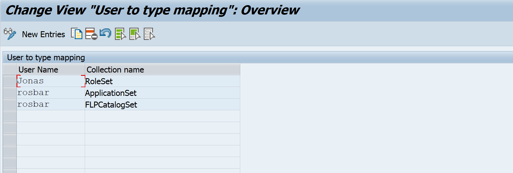

# Steps for UX Lead (Fiori Dev)

To install the „Main part” of the Fiori Tracker, please follow the steps described below.

## Step 1 - Add intervals for number ranges

**4.1** Run **ZFTSETUP** transaction. 
**4.2** Choose **"Create number range intervals"**. 
**4.3** If every objects' intervals have been changed successfully - you should see below screen. 

!> **Current index** for each object should be set to 1.

## Step 2 - Create initial area codes

In this step, you can create initial codes for your business areas. All applications, business catalogs, and roles could be assigned to a specific area (please find example area codes below).

## Step 3 - Create default initial data

In this step, you create default initial data for Fiori Tracker based on the information you have provided in the previous steps.

## Step 4 - Modify configuration

In this step you can modify Fiori Tracker configuration:
- CatalogNamingRule - rules for catalog naming
- CatalogsImportIsTechnicalCatalogCheckZC – activation of catalog naming convention check
- IsProductive – sets installation of Fiori Tracker as a productive one.
- ProductiveSystemAddress – Sets the address of your productive system
- ProductiveSystemId – Sets the production System ID
- SapVersion - your S/4 HANA version
- IsSolManVersion – Sets Fiori Tracker installation as installed on Solution Manager

You can find detailed description of each parameter in section [Main config](/conf/conf). 

## Step 5 - Modify application types

In this step, you can change application types. We recommend using our proposition of them based on the SAP Fiori apps reference library (please find them below).

You can find detailed description of each parameter in section [Application types](/conf/apptypes)

## Step 6 - Modify sign off types

In this step, you can change sign off types. They should be relevant to the steps of your development process (please find the example below).

## Step 7 - Modify provisioning types

In this step, you can change provisioning types. They should be relevant to your system landscape (please find the example below).

## Step 8 - Modify user responsible for an area

In this step, you can change users responsible for specific business areas f.e. stream leads.

## Step 9 - Modify user responsible for the provisioning of a specific set

In this step, you can change users responsible for the provisioning of a specific set f.e. applications.

## Step 10 - Check if the Fiori Tracker applications run correctly

There are two ways to start Fiori Tracker applications:

From your SAP Fiori Launchpad:
- Login and start the SAP Fiori Launchpad with the user that you have configured in Step 3 of the installation guide.

You can also start the Fiori Tracker as an standalone application:
- **yourhost:port**/sap/bc/ui5_ui5/sap/zfioritracker/ 
f.e. https://demo.fioritracker.org/sap/bc/ui5_ui5/sap/zfioritracker/

