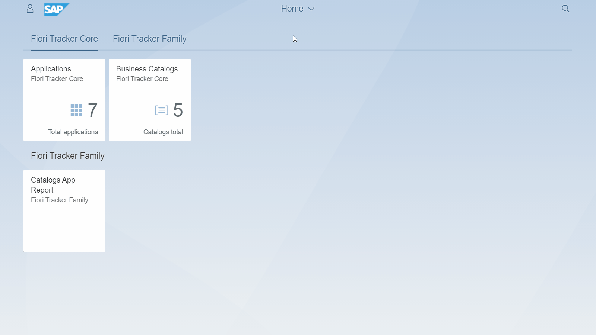
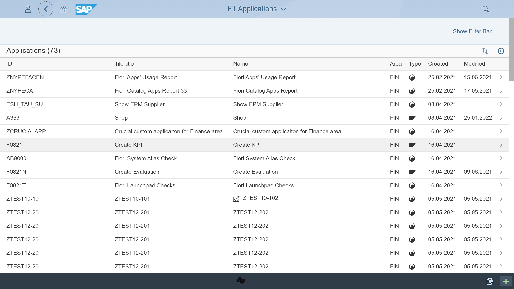
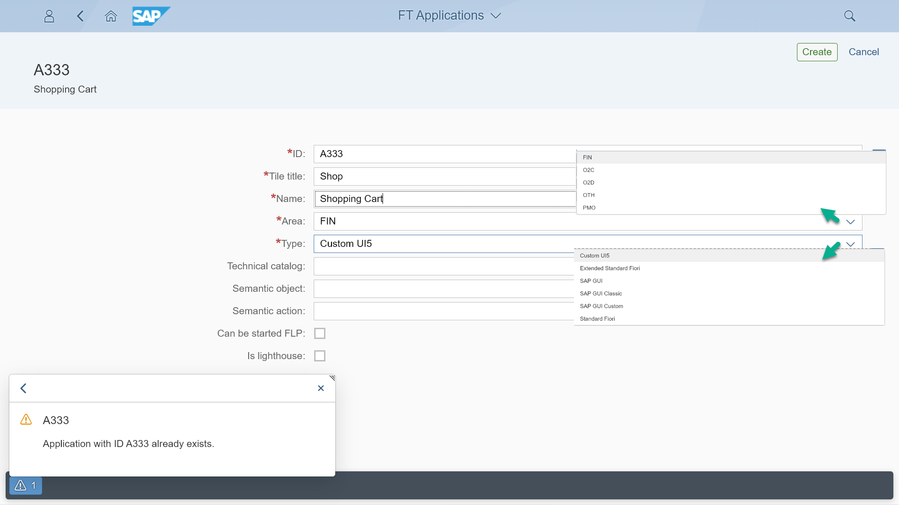
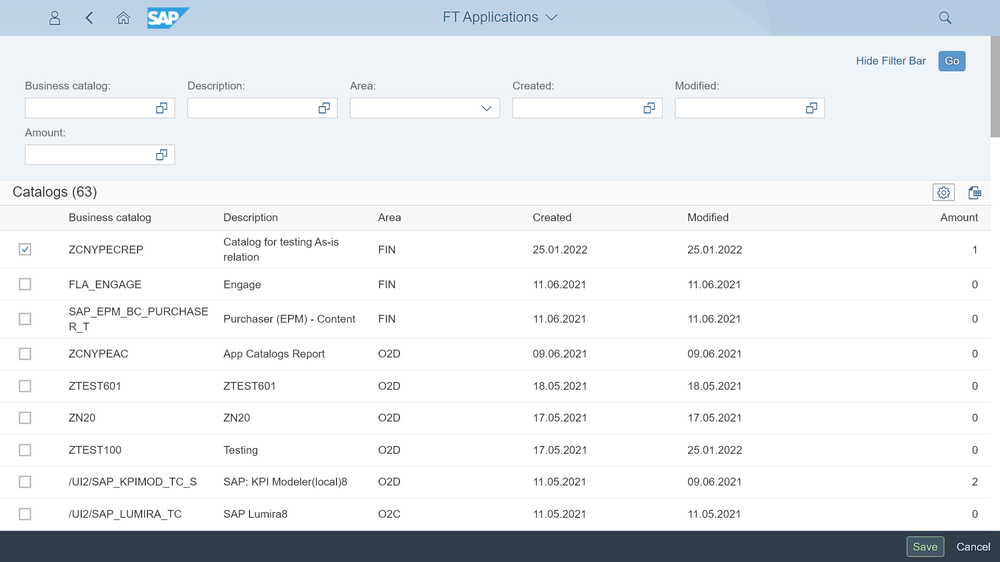
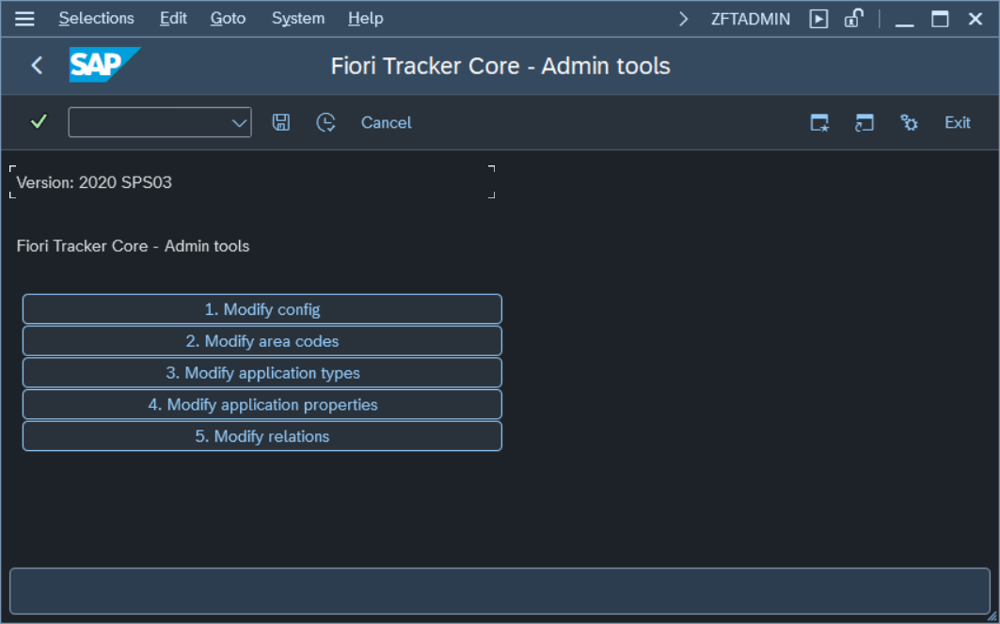

# FT Applications

## How it works

With the help of the application `FT Applications`, you can store the records of all your Fiori launchpad-enabled applications. The list of all apps stored in `FT Applications` serves as a directory of all applications in the project scope. Application records are kept as [Specification records](../specification-records.md) and referred to with an `App ID`. The records serve as a single point of truth for application information in your project (project's "SAP Fiori library"). A major benefit is having custom and extended app records in one central place.

### Attributes of App Specification record

Fiori Tracker keeps the following attributes for an app entry:

| Name      | Description                                                                                                             |
|-----------|-------------------------------------------------------------------------------------------------------------------------|
| Id        | App identifier. For SAP standard application, we recommend the use of application id from Fiori Apps Library        |
| Name      | The name of the application                                                                                             |
| Tile tile | The name to be set for Fiori Launchpad tile                                                                           |
| Area      | Functional area chosen from the list of areas in your project. The list is configurable.                             |
| Type      | Type of the application. Fiori Tracker comes with predefined application types. The list is configurable.             |
| Created   | The date on which the application Specification entry was created.   It is the date of including the app in the project scope. |
| Modified  | The date on which the user has changed the attributes of app.   |

### Specifying SAP Fiori launchpad applications

To start working with Fiori Tracker, you need to specify all applications that you plan to enable in your SAP Fiori Launchpad. You do that with the `FT Applications` app. The app starts with the current list of all applications in your project scope.

*Starting view of `FT Applications` app*

With the “Add” function, you can add a new application entry:

*Create an application record form in the `FT Applications` app*

The recorded details include:

- App ID – application prevents the creation of duplicates.
- Tile title – The title might be different from the official application name.
- Name – Contains the official application name.
- Area – You can choose a functional area. The area comes from the configurable list of areas specific to your project.
- Type – You can choose the type of application. The choice comes from the list of configurable types specific to your project. Fiori Tracker comes with predefined application types.
- Technical catalog, Semantic object, action, and flags indicating if the app can start directly and if it is a lighthouse app are optional. They either serve as additional information, or you can use them after installing optional Fiori Tracker suite components.

### Mapping apps to a catalog

To maintain the mapping of an app choose `Catalog Specification` relation and `Edit`:

*Edit view for mapping catalogs in the `FT Applications` app*

All marked catalogs get assigned to the app.  

In the same way as for apps, the mapping function is available from an [catalog perspective](cats.md/#mapping-apps-to-a-catalog).

## How to configure it

To configure Fiori Tracker core use SAP Gui transaction `ZFTADMIN`:

### Modify config

The "Modify config" function allows you to set configuration parameters.

| Key                          | Value     | Description                                                                                                                                                                    |
|------------------------------|-----------|------------------------------------------------------------------------------|
| INCOMP_HIDE                  | **TRUE** | When set to TRUE the version compatibility warning will not show |

### Area codes

The "Modify area codes" function allows you to define the names of the areas used in your project.

### Application types

Allows you to modify or add the application types.

### Application properties

Allows you to choose additional properties. Attributes can be switched on and off depending on your project needs.

| Key | Description  |
|--|--|
| GIT_REPO | Custom app or extension git repository name | 
| UI5_COMP_NAME | UI5 component name | 
| DOCS | Link to technical documentation nof the app| 
| TR_PACKAGE | Transport package containing all the app's objects | 
| MAIN_ODATA_SRV | Main oData service | 
| OriginalAppId | In case of extended app the original App ID | 
| OriginalAppName | In case of extended app the original App name | 
| IsLighthouse | Is the application Lighthouse| 
| IS_MIGRATED_BAS | Was the app migrated to SAP Business Application Studio already | 
| GOLIVE_ON | Date on which the app went live |
| IS_MARKED_AS_DELETED | Is the app deleted  | 
| CAN_BE_STARTED_FROM_FLP | Can the user start the app from Fiori Launchpad |
| DESC1 | Custom attribute 1 | 
| DESC2 | Custom attribute 1 |
| DESC3 | Custom attribute 1 | 
| DESC4 | Custom attribute 1 | 

### Relations

Allows you to choose available relations. 