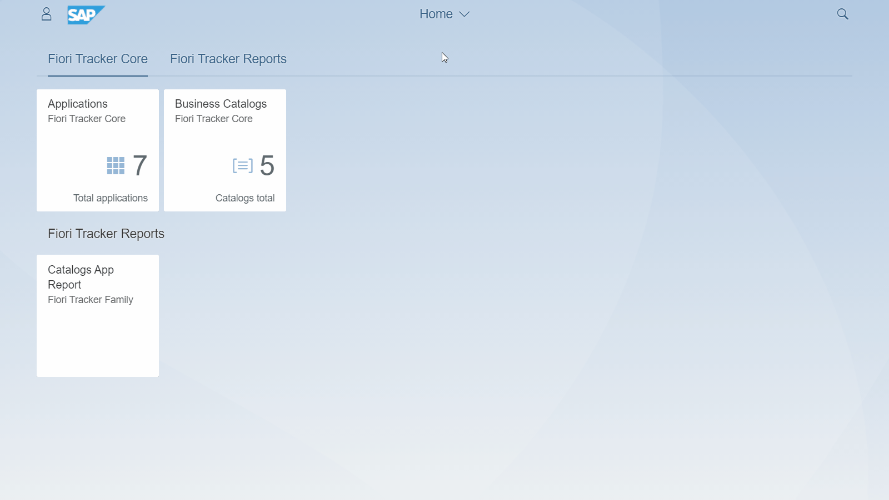

# FT Catalogs

## How it works

### Specifying SAP Fiori launchpad catalogs

This feature lets you create documentation entries for your launchpad Business Catalogs. The feature is available in app called `FT Catalogs` and starts with the list of the catalogs in the project scope:

*Starting view of `FT Catalogs` app*

`Add` button creates an entry for the new catalog:

*Create catalog record form in the `FT Catalogs` app*

The app uses the same functional area set to assign catalog and use Fiori Tracker reports on a specific stream or to assign stream default person responsible for sing-offs.

### Mapping apps to a catalog

You can maintain the mapping from the Catalog app where you can choose `Applications Specification` relation and `Edit`:

*View with a chosen catalog record and its `Applications` relation in the `FT Catalogs` app*

*Edit view for mapping application in `FT Catalogs` app*

All marked apps get assigned to the catalog. 

In the same way as for catalogs, the mapping function is available from an [application perspective](apps.md#mapping-apps-to-a-catalog).

