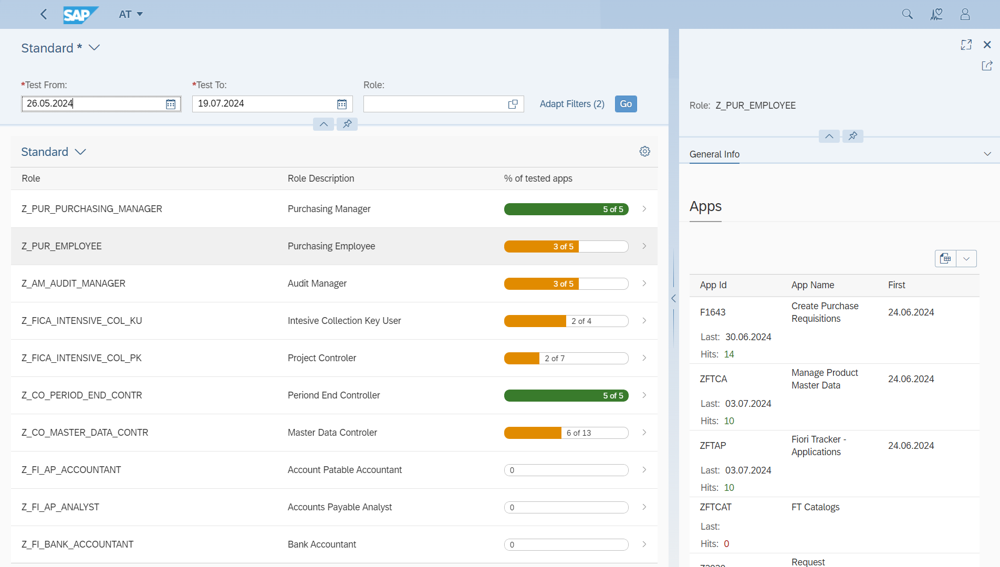

# Fiori Role testing

## Overview

Fiori Role Testing tracks role testing to ensure the team tests all SAP Fiori applications before production deployment. It uses Fiori App Usage to log each app's start, confirming it has been tested.

