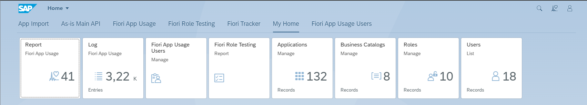

# Features

Fiori Tracker is packed with many great features that make the SAP S/4HANA project work easier. This documentation section explains how to un reports showing usage records and document all SAP Fiori launchpad content objects.

*Fiori Tracker Core group tiles*

The [Fiori App Usage Report](usage-report.md) shows which apps in your S/4HANA system are used the most. It tracks how often each app was opened today and last week.

The [User Usage Report](user-usage-report.md)  shows which apps each user accessed and how many times.

The [Usage Log Report](usage-log.md) gives a full list of app usage, including system, user, app ID, app name, and when it was used. 

To gain other insights, you can export the usage logs or directly access them from the system table and integrate them with your existing analytics tools, such as SAP Cloud analytics.