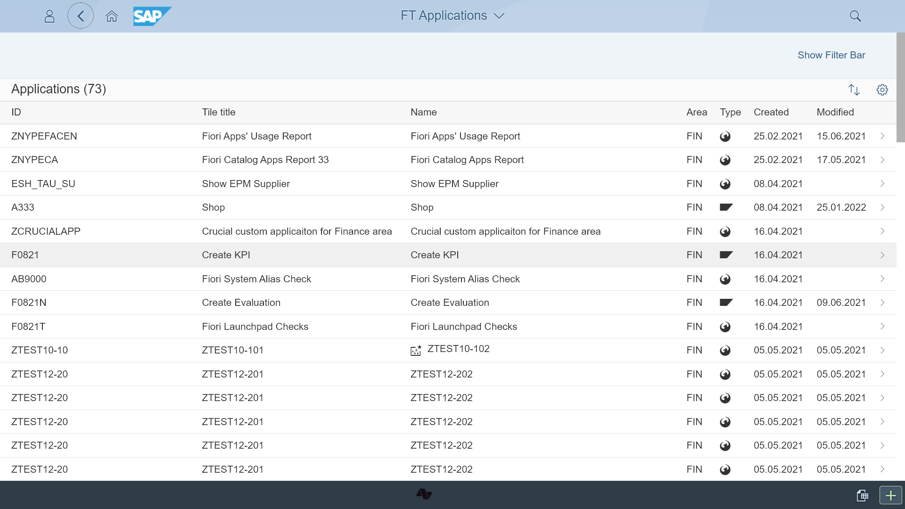
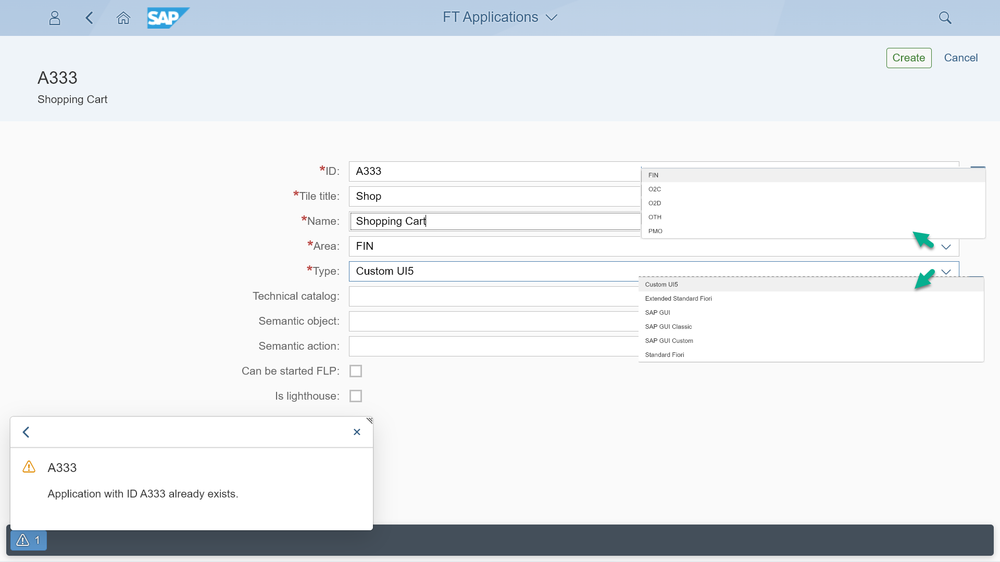

# Specifying SAP Fiori launchpad applications

To start working with Fiori Tracker, you need to specify all applications that you plan to enable in your SAP Fiori Launchpad. You do that with the `FT Applications` app. The app starts with the current list of all applications in your project scope.

*Starting view of `FT Applications` app*

With the “Add” function, you can add a new application entry:

*Create an application record form in the `FT Applications` app*

The recorded details include:

- App ID – application prevents the creation of duplicates.
- Tile title – The title might be different from the official application name.
- Name – Contains the official application name.
- Area – You can choose a functional area. The area comes from the configurable list of areas specific to your project.
- Type – You can choose the type of application. The choice comes from the list of configurable types specific to your project. Fiori Tracker comes with predefined application types.
- Technical catalog, Semantic object, action, and flags indicating if the app can start directly and if it is a lighthouse app are optional. They either serve as additional information, or you can use them after installing optional Fiori Tracker suite components.