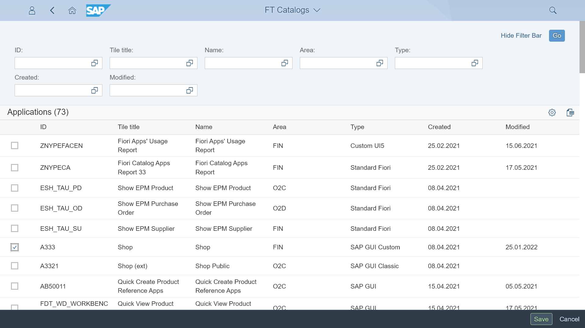
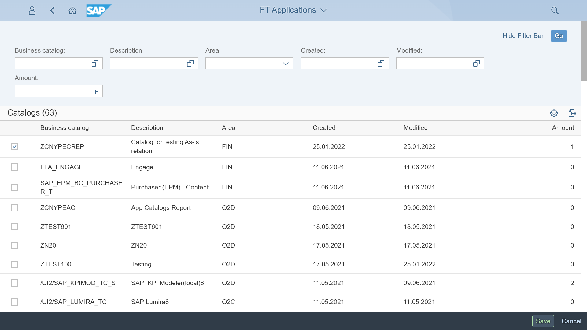

# Specifying SAP Fiori launchpad catalogs

Once you finish with applications, you can proceed with creating documentation entries for your launchpad Business Catalogs. The app to manage catalogs is called “FT Catalogs” and starts with the list of the catalogs in the project scope:

*Starting view of “FT Catalogs” app*

Add button creates an entry for the new catalog:

*Create catalog record form in the “FT Catalogs” app*

The app uses the same functional area set to assign catalog and use Fiori Tracker reports on a specific stream or to assign stream default person responsible for sing-offs.

Maintaining mapping between catalogs and applications
Once all catalogs are in, you can map applications to catalogs. You can do that from a catalog perspective by opening chosen catalog detail view and its “Applications Specification” relation and choosing “Edit”:

*View with a chosen catalog record and its “Applications To-Be” relation in the “FT Catalogs” app*

*Edit view for mapping application in “FT Catalogs” app*

All marked apps get assigned to the catalog. In the same way as for catalogs, the mapping function is available from an application perspective:

*Edit view for mapping catalogs in the “FT Applications” app*

These two apps will significantly reduce the time the project and support team need to agree and handle the launchpad catalogs and their apps. Optional components link the application and catalog to other information records like roles, test users’ passwords, sign-off records, or application usage data.

