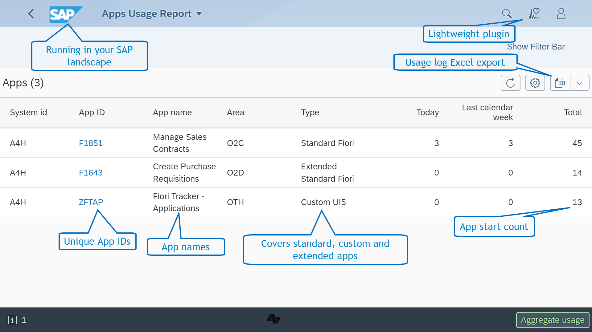
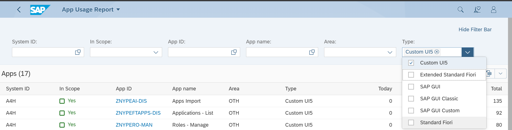
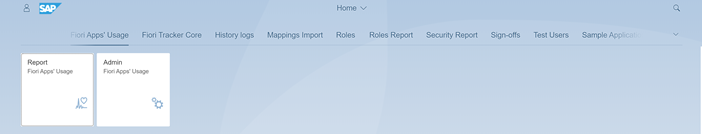
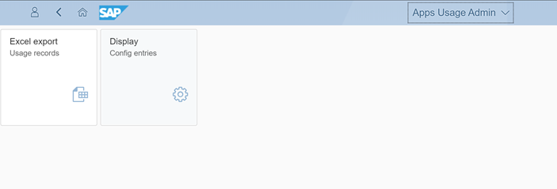
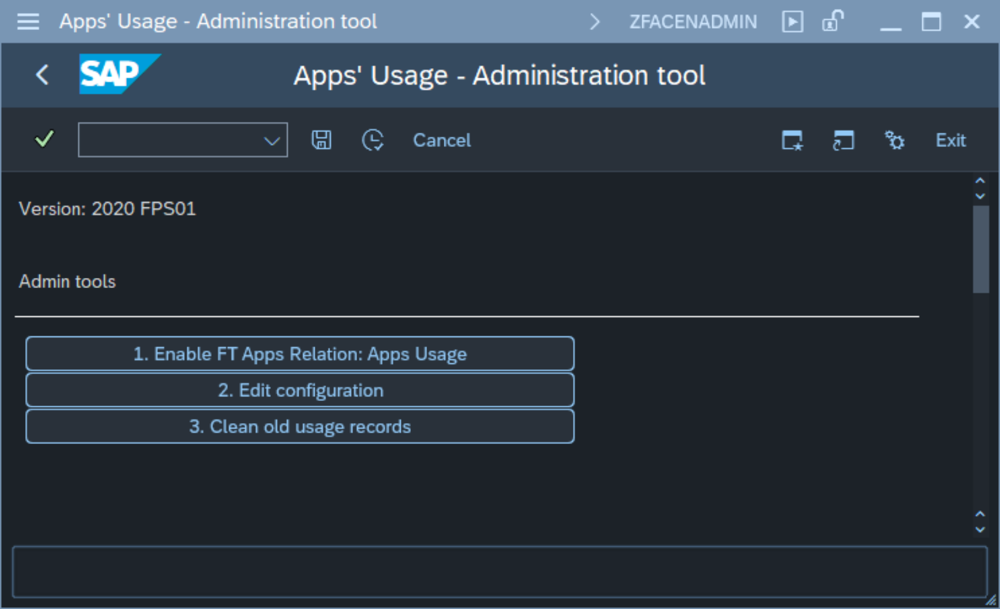
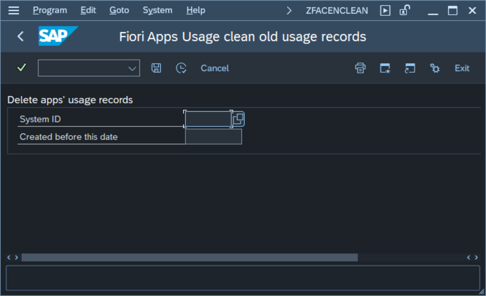
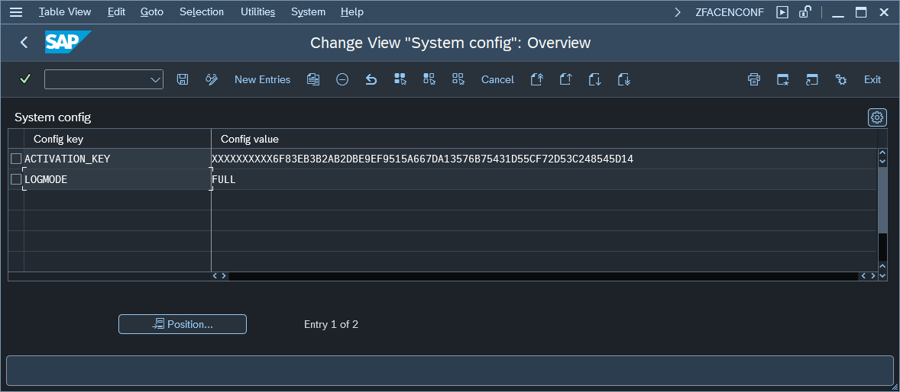

# App usage report

## Overview

Fiori Tracker provides an app listing the most frequently used applications in your system. The app list is displayed with unique app IDs for all apps, including extended and custom apps.

##  Filtering

The report offers the following filters to allow you to categorize applications by functional area and application type, as well as identify applications outside the project's scope.

1. Filtering on Functional Area

2. Filtering on Application Type - e.g., generating a list of Custom UI5 apps only). 

3. Identifying Applications Outside Scope - by filtering usage records without application ID, you will obtain a list of applications that fall outside the project scope. 

## Records export

Fiori Apps Usage Report offers raw usage records export in Excel format. Export function lets you prepare statistic reports and data visualizations with your favorite analytical tool.

The function is available from the App Usage Admin app:

[Example export file](res/apps-usage-export.xlsx)

## Cleaning tool

Old usage records can be removed with cleaning tool. The cleaning tool is available form Administration tool started with transaction **ZFACENADMIN**. To lunch the tool start the transaction and chose function *3. Clean old usage records*:

The cleaning tool has two input fields:

1. System ID - specifies the system for which you want to delete the records
2. Created before this date - It allows you to define the cut-off date. All records saved prior to this date will be deleted.

## Configuration

To change Central part configuration start the transaction `ZFACENADMIN` and press button labeled: **2. Edit configuration**. This action will open a configuration screen:

The table below describes all available parameters:

| Key                   | Value     | Description            |
|-----------------------|-----------|------------------------|
| ACTIVATION_KEY        | *key*     | Value is provided by Nype team         |
| INCOMP_HIDE           | **TRUE** | When set to TRUE the version compatibility warning will not show |
| LOGMODE               | **FULL** | Plugin will write down usage records only when this parameter is set to **FULL**. Delete this parameter to stop writing usage records. This allows stopping log collection without removing user's Fiori App Usage role.|

