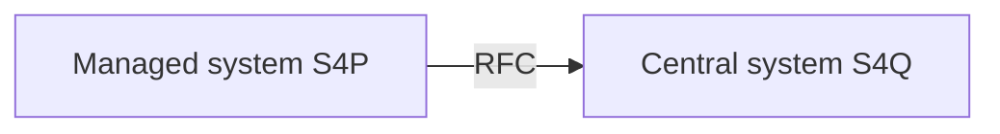

# How to prepare the RFC destination pointing from Managed system to Central system

On the Managed system you need to create an RFC destination pointing to your Central system.

Create RFC destination in your Managed system using SAP GUI transaction `SM59`. 
The user set in the RFC destination should have type `SYSTEM`, and the following authorizations in the Central system:

Authorization object: S_RFC

|Field|Value|
|--|--|
|ACTVT| 16|
|RFC_TYPE| FUGR|
|RFC_NAME| ZNYPEFACEN|
