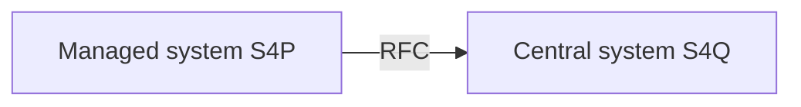

# How to prepare the RFC destination pointing from Managed system to Central system

On the Managed system you need to create an RFC destination pointing to your Central system.

Create an RFC destination in your Managed system using SAP GUI transaction `SM59`. 
The RFC destination needs to set a user of type `SYSTEM` and the user needs to have the following authorizations in the Managed system:

Authorization object: `S_RFC`

|Field|Value|
|--|--|
|ACTVT| 16|
|RFC_TYPE| FUGR|
|RFC_NAME| ZNYPEFACEN|

See also:

- [How to prepare the RFC destination pointing from Central system to Managed system](rfc.md)
