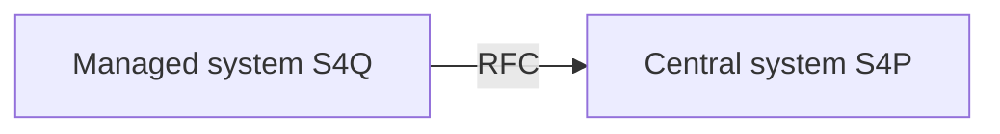

# How to prepare the RFC destination pointing from Central system to Managed system

On the Central system you need to create an RFC destination pointing to your Managed system.

Create an RFC destination for each of your Managed systems in your Central system using SAP GUI transaction `SM59`. 
The RFC destination needs to set a user of type `SYSTEM` and the user needs to have the following authorizations in the Central system:

Authorization object: `S_RFC`

|Field|Value|
|--|--|
|ACTVT| 16|
|RFC_TYPE| FUGR|
|RFC_NAME| ZNYPEASISMAN, SUNI|

|Field|Value|
|--|--|
|ACTVT| 16|
|RFC_TYPE| FUNC|
|RFC_NAME| Z_NYPEASISMAN_GET_CATALOGS, Z_NYPEASISMAN_GET_APPLICATIONS, Z_NYPEASIS_MAN_GET_VERSION, RFC_PING, FUNCTION_EXISTS|

See also:

- [How to prepare the RFC destination pointing from Managed system to Central system](rfc-FAU-plugin.md)
