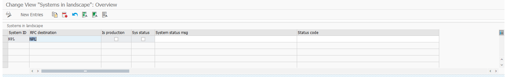

# Configure managed systems

1. In your Central system, using SAP GUI transaction **ZASISADMIN** start step `1. Modify Managed systems`:

For each Managed system defined by column `System ID` provide respective `RFC destination` (see [how to prepare it](rfc.md)). Leave the rest of the fields - they are updated automatically on each *Connection status check*.
