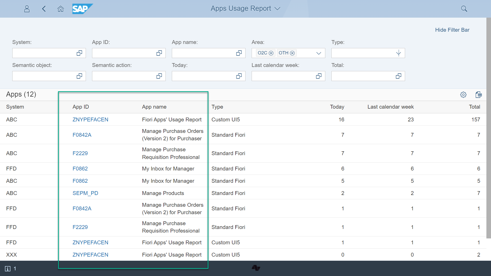

# Universal application identification

Clear identification of the applications in scope.

<!-- more -->

## Challenges

1. How can the user tell the correct app he has issues with when calling the support center agent?
2. How can the project members indicate the applications that require:

    * Status tracking (in development, testing, and documentation process)
    * Assignment  to a business area to set the responsibility (when developing, testing, and supporting applications)

## How did the Fiori Tracker address the challenge?

To address the need for clear application identification Fiori Tracker keeps records of ["Content type: Application"](../../tracked/SPS03/apps.md). With the help of application ["FT Applications"](../../core/SPS03/apps.md) you can store the records of all your Fiori launchpad enabled applications in scope. Application records are kept as Specification records and referred with an "App ID". The records serve as a single point of truth for application information in your project. 

Naming convention for "App Id" is a decision of the user. For SAP standard apps we recommend using the "App ID" field from SAP Fiori Apps Reference Library. For example ["F1048"](https://fioriappslibrary.hana.ondemand.com/sap/fix/externalViewer/#/detail/Apps\('F1048'\)/S25OP)

In [conventions to consider](naming-apps.md) we have listed the ones we have found useful. 

